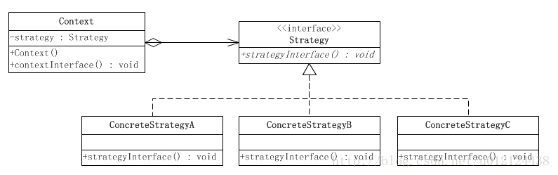

# 设计模式

## 常用的设计模式分类
### 创建型
- 工厂方法模式  --- Factory Method
- 抽象方法模式  --- Abstract Factory
- 建造者模式 --- Builder
- 原型模式 --- Prototype
- 单例模式 --- Singleton

### 结构型
- 适配器模式 --- Adapter
- 桥接模式 --- Bridge
- 组合模式 --- Component
- 装饰器模式 --- Decorator
- 门面模式 --- Facade
- 享元模式 --- Flyweight
- 代理模式 --- Proxy

### 行为型
- 解释器模式 --- Interpreter
- 模板方法模式 --- Template Method
- 责任链模式 --- Chain of Responsibility
- 命令模式 --- Command
- 迭代器模式 --- Iterator
- 调节者模式 --- Mediator
- 备忘录模式 --- Memento
- 观察者模式 --- Observer
- 状态模式 --- State
- 策略模式 --- Strategy
- 访问者模式 --- Visitor
## 模式
### 工厂模式 --- factory
#### 简单工厂模式
- 工厂模式的雏形
- 但是有判断来寻找创建的模型，不够友好，容易出错， 不易扩展
```java
//类似于这种
public class OilSimpleFactory {
    public static Oil getOil(String name) {
        if ("花生".equals(name)) {
            return new ArachisOil();
        } else if ("菜籽".equals(name)) {
            return new ColzaOil();
        } else {
            return null;
        }
    }
}
```
#### 工厂模式
- 进一步封装了， 但是使用时还是要指定某个工厂， 容易出错
```java
public interface OilFunFactory {
    public Oil getOil();
}

public class ColzaOilFactory implements OilFunFactory {
    @Override
    public Oil getOil() {
        return new ColzaOil();
    }
}

public class ArachisOilFactory implements OilFunFactory{
    @Override
    public Oil getOil() {
        return new ArachisOil();
    }
}

public class Test {

    @org.junit.Test
    public void testA() {
        OilFunFactory oilFunFactory = new ArachisOilFactory();
        oilFunFactory.getOil().produceOil();
    }
}
```
#### 抽象工厂模式
- 封装性更高了，用户只能通过内部的方法来指定相应的工厂
- 用户的不容易出错
- 易于扩展， 用户只知道添加了一个方法， 但是不知道该方法内部具体实现

### 单例模式
- 全局只产生一个对象
- 因为构造函数被私有了， 所以要使用的方法只能是静态的被`static`修饰
#### 饿汉式
- 避免了反射的入侵， 在使用反射时，因为是`static final`修饰，所以不能被赋值
```java
/* Exception in thread "main" java.lang.IllegalAccessException: 
Can not set static final com.douby.pattern.singleton.hungry.HungrySingleton field 
com.douby.pattern.singleton.hungry.HungrySingleton.singleton to 
com.douby.pattern.singleton.hungry.HungrySingleton
	at sun.reflect.UnsafeFieldAccessorImpl.throwFinalFieldIllegalAccessException(UnsafeFieldAccessorImpl.java:76)
	at sun.reflect.UnsafeFieldAccessorImpl.throwFinalFieldIllegalAccessException(UnsafeFieldAccessorImpl.java:80)
	at sun.reflect.UnsafeQualifiedStaticObjectFieldAccessorImpl.set(UnsafeQualifiedStaticObjectFieldAccessorImpl.java:77)
	*/

```
- 线程安全，类初始化时就会创建了
- 占内存， 在类初始化时就存在了，会一直占内存
```java
public class HungrySingleton {

    private static final HungrySingleton singleton = new HungrySingleton();

    private HungrySingleton(){

    }

    public HungrySingleton getSingleton(){
        return singleton;
    }
}
```
#### 懒汉式
##### 不安全的懒汉
- 当要使用到该对象时 再创建对象
- 线程不安全， 节省内存，效率高
- 线程不安全原因： 多个线程同时访问时， 判断`singleton == null`时，会出现同时判断为`true`， 进入判断创建新对象
```java
public class UnSyncSingleton {

    private static UnSyncSingleton singleton = null;

    private UnSyncSingleton() {

    }

    public static UnSyncSingleton getSingleton() {
        if (singleton == null) {
            singleton = new UnSyncSingleton();
        }
        return singleton;
    }
}
```
##### Double Check Locking 懒汉
- [volited关键字，很好的一篇博客， 特别是下面的链接]https://www.cnblogs.com/dolphin0520/p/3920373.html
- 当要使用到该对象时 再创建对象
- 节省内存， 线程安全， 效率不怎么高（有`synchronized`的效率都不怎么高）
- Double Check的用途: 第一个 判断对象是否为空， 过滤掉一部分的请求创建的过程； 第二个 多个线程通过第一个判断之后会进入初始化的过程，第二个判断是为了其他线程在某一线程创建完对象后再创建
- 在此单例中对象要用`volatile`来修饰， 不用此关键字修饰的话，该单例是不成立错误的；原因是当不使用`volatile`时
在执行代码中的`2`操作时，对象初始化时间假设过长， 已经赋值还未初始化完成，另一线程在执行`1`步骤时直接返回了初始
化不完全的对象，会引起错误。 使用`volatile`可以解决该问题， 因为`volatile`修饰的对象可以保证其有序性， 即当对`volatile`
修饰的对象进行读写时，该操作直接的所有操作都是已经完成的。
```java
public class DoubleCheckSingleton {

    private static volatile DoubleCheckSingleton singleton = null;

    private DoubleCheckSingleton(){

    }

    public static DoubleCheckSingleton getSingleton(){
        if (singleton == null){//1
            synchronized (DoubleCheckSingleton.class){
                if (singleton == null){
                    singleton = new DoubleCheckSingleton();//2
                }
            }
        }
        return singleton;
    }
}
```
##### 静态内部类 懒汉
- 通过静态内部类的特性，静态参数只初始化一次，属于该内部类对象，所以单例对象只会初始化一次，可以保证其线程安全
- 静态内部类只有被调用的时候才会被加载，所以又避免了饿汉式的问题
- 通过反射是不会获取到内部类的属性的
- 优点：集合了饿汉式的优点（不会被反射入侵）和懒汉式的优点（只有在使用时才会被加载出来）
```java
public class StaticInnerClassSingleton {
    
    private StaticInnerClassSingleton(){

    }

    public static StaticInnerClassSingleton getSingleton(){
        return Inner.INNER_CLASS_SINGLETON;
    }

    private static class Inner{
        private static final StaticInnerClassSingleton INNER_CLASS_SINGLETON = 
        new StaticInnerClassSingleton();
    }
}

```
#### 注册式
- 通过`ConcurrentHashMap`来保证该单例是线程安全的
```java
public class RegistSingleton {
    /**
     * 保证线程安全
     */
    private static final Map<String, RegistSingleton> map = new ConcurrentHashMap<>();

    private RegistSingleton(){
    }

    public static RegistSingleton getSingleton(String key){
        if (key == null || "".equals(key)){
            key = RegistSingleton.class.getName();
        }
        if (map.get(key) == null){
            map.put(key, new RegistSingleton());
        }
        return map.get(key);
    }
}
```
#### 序列化式
```java
public class SeriSingleton implements Serializable{
    private static final long serialVersionUID = 2406911937722484087L;
    private SeriSingleton(){

    }

    private static final SeriSingleton seriSingleton = new SeriSingleton();

    public static SeriSingleton getSingleton() {
        return seriSingleton;
    }

    /**
     * 为了防止反序列化破坏单例
     * @return
     */
    public Object readResolve(){
        return seriSingleton;
    }
}


public class Demo {
    public static void main(String[] args) throws IOException, ClassNotFoundException {
        SeriSingleton s1 = SeriSingleton.getSingleton();
        writeSingleton(s1);
        SeriSingleton s2 = readSingleton();
        System.out.println(s1 == s2);
    }

    private static void writeSingleton(SeriSingleton singleton) throws IOException {
        Class clazz =Demo.class;
        URL url = clazz.getResource("/seri2.txt");
        String fileUrl = url.getFile();
        FileOutputStream fos = new FileOutputStream(fileUrl);
        ObjectOutputStream oos = new ObjectOutputStream(fos);
        oos.writeObject(singleton);
        oos.close();
    }

    private static SeriSingleton readSingleton() throws IOException, ClassNotFoundException {
        Class clazz =Demo.class;
        URL url = clazz.getResource("/seri2.txt");
        String fileUrl = url.getFile();
        FileInputStream fis = new FileInputStream(fileUrl);
        ObjectInputStream ois = new ObjectInputStream(fis);
        SeriSingleton seriSingleton = (SeriSingleton) ois.readObject();
        return seriSingleton;
    }
}
```
### 原型模式
- 个人理解的原型模式就是一个对象的浅克隆和深克隆
- 创建重复的对象且创建对象的代价比价大时可以采取这种模式
- 通过克隆技术将对象完整的复制一份
- 浅克隆：只是克隆基本类型和String， 对象属性不会进行克隆，只会引用相同的对象地址
```java
public class Color {
    private int r;
    private int g;
    private int b;

    public int getR() {
        return r;
    }

    public void setR(int r) {
        this.r = r;
    }

    public int getG() {
        return g;
    }

    public void setG(int g) {
        this.g = g;
    }

    public int getB() {
        return b;
    }

    public void setB(int b) {
        this.b = b;
    }

    public Color() {
    }

    public Color(int r, int g, int b) {
        this.r = r;
        this.g = g;
        this.b = b;
    }
}

public class Shape implements Cloneable{
    private String name;

    private Color color;

    public String getName() {
        return name;
    }

    public void setName(String name) {
        this.name = name;
    }

    public Color getColor() {
        return color;
    }

    public void setColor(Color color) {
        this.color = color;
    }

    public Shape(String name, Color color) {
        this.name = name;
        this.color = color;
    }

    public Shape() {
    }

    public Shape(String name) {
        this.name = name;
    }

    @Override
    public Shape clone() {
        try {
            return (Shape) super.clone();
        }catch (CloneNotSupportedException ce){
            ce.printStackTrace();
            return new Shape();
        }
    }
}

```
- 深克隆：所有的属性都会进行克隆。可以通过序列化或者手动克隆属性对象；但是这两种都要实现接口（Clonable或者Serializable）。新的类还好一点，旧的类的话会麻烦一点
```java
public class Color implements Cloneable, Serializable{
    private static final long serialVersionUID = -7984503975838142534L;
    private int r;
    private int g;
    private int b;

    public int getR() {
        return r;
    }

    public void setR(int r) {
        this.r = r;
    }

    public int getG() {
        return g;
    }

    public void setG(int g) {
        this.g = g;
    }

    public int getB() {
        return b;
    }

    public void setB(int b) {
        this.b = b;
    }

    public Color() {
    }

    public Color(int r, int g, int b) {
        this.r = r;
        this.g = g;
        this.b = b;
    }

    @Override
    public Color clone(){
        try {
            return (Color) super.clone();
        } catch (CloneNotSupportedException e) {
            e.printStackTrace();
            return new Color();
        }
    }
}


public class Shape implements Cloneable, Serializable {
    private static final long serialVersionUID = 3141474823170397097L;
    private String name;

    private Color color;

    public String getName() {
        return name;
    }

    public void setName(String name) {
        this.name = name;
    }

    public Color getColor() {
        return color;
    }

    public void setColor(Color color) {
        this.color = color;
    }

    public Shape(String name, Color color) {
        this.name = name;
        this.color = color;
    }

    public Shape() {
    }

    public Shape(String name) {
        this.name = name;
    }

    @Override
    public Shape clone() {
        return deepClone();
//  两种都可以使用， deepClone是实现Serializable接口， 下面的是实现Cloneable接口
//        try {
//            Shape shape = (Shape) super.clone();
//            shape.color = shape.color.clone();
//            return shape;
//        }catch (CloneNotSupportedException ce){
//            ce.printStackTrace();
//            return new Shape();
//        }
    }

    private Shape deepClone() {
        try {
            ByteOutputStream bos = new ByteOutputStream();
            ObjectOutputStream oos = new ObjectOutputStream(bos);
            oos.writeObject(this);

            ByteInputStream bis = new ByteInputStream(bos.toByteArray(), bos.getBytes().length);
            ObjectInputStream ois = new ObjectInputStream(bis);
            return (Shape) ois.readObject();
        } catch (IOException e) {
            e.printStackTrace();
        } catch (ClassNotFoundException e) {
            e.printStackTrace();
        }
        return new Shape();
    }
}
```
### 代理模式
- 为其他对象提供一种代理控制对这个对象的访问，对被代理的对象的功能进行增强
- 场景: 事务代理，非侵入式日志监听
- 代理模式分为`静态代理`、`JDK动态代理`、`CGLB动态代理`
- 为什么使用代理模式：当我们需要对类的方法的进行功能的增强时，使用代理类。避免了直接修改源码。
- 静态代理：只能对某个具体的类进行代理
```java
/**
* 缺点：如果项目中存在多个需要被代理的类，它需要编写多个代理类，工作量巨大
*/
public class BaseProxy {
    private BaseInt baseInt;

    public BaseProxy(BaseInt baseInt){
        this.baseInt = baseInt;
    }

    public void baseMethod_1(){
        System.out.println("静态代理 增强 开始。。。。。。");
        baseInt.baseMethod_1();
        System.out.println("静态代理 增强 结束。。。。。。");
    }

    public void baseMethod_2(){
        System.out.println("静态代理 增强 开始。。。。。。");
        baseInt.baseMethod_2();
        System.out.println("静态代理 增强 结束。。。。。。");
    }
}
```
- JDK动态代理：是对接口下的所有实现类进行代理， 是面向接口的
```java
/**
* jdk的动态代理可以在运行时生成动态代码，不用去一个类一个类的去编码代理类
* 只要实现了某接口就行。节省了工作量。
* 但是JDK的动态代理，代理的类必须实现接口未实现接口的类不能被JDK动态代理
*/
public class JdkProxy implements InvocationHandler {

    /**
     * 被增强的目标对象
     */
    private BaseInt target;

    public Object getProxyInstance(BaseInt baseInt) {
        this.target = baseInt;
        Class<?> clazz = target.getClass();
        return Proxy.newProxyInstance(clazz.getClassLoader(), clazz.getInterfaces(), this);
    }

    @Override
    public Object invoke(Object proxy, Method method, Object[] args) throws Throwable {
        System.out.println("JDK 增强。。。。。。。。。。");
        Object object = method.invoke(proxy, args);
        System.out.println("JDK 增强结束。。。。。。。。。。");
        return object;
    }
}
```
- CGLIB动态代理：是动态生成一个类的子类，对该子类进行代理
```java
/**
* 个人理解他是对JDK代理的一种补充
* CGLIB动态代理不需要被代理的类实现接口， 它是动态的生成被代理类的一个子类
* 然后进行方法的增强，但是被代理的类必须是可继承的 即类不能被final修饰
*/
public class CglibProxy implements MethodInterceptor {

    public Object getInstance(Class<?> clazz){
        Enhancer enhancer = new Enhancer();
        enhancer.setSuperclass(clazz);
        enhancer.setCallback(this);
        return enhancer.create();
    }
    @Override
    public Object intercept(Object o, Method method, Object[] objects, MethodProxy methodProxy) throws Throwable {
        System.out.println("cglib代理 start ......");
        Object object = methodProxy.invokeSuper(o, objects);
        System.out.println("cglib代理 end ......");
        return object;
    }
}
```
### 策略模式
####策略模式的定义
- 在大部分的介绍上都说，策略模式就是定义一组算法，让它们可以互相替换， 让算法独立于客户
- 个人理解就是，以往在写的时候都是`if`、`else`、`case`将所有的情况都写到了一块， 策略模式恰恰解决了这种问题，
将每个`if`、`else`、`case`中的实现都封装成一个对象，由使用它的客户端来决定策略使用，当然这只是通过
这种举例来理解策略模式。粗略的讲，策略模式就是为实现相同的目的，而做出多种不同的过程
- 这是网上的一段话，用以加深理解：
```text
策略模式是一种行为模式。用于某一个具体的项目有多个可供选择的算法策略，客户端在其运行时根据
不同需求决定使用某一具体算法策略。

将算法和对象分开，使算法独立于使用它的用户。将一个类（环境）中经常改变或将来可能改变的部分
提取出来，作为一个接口（抽象策略），然后在类中包含这个对象的实例，这样类的实例在运行时就可
以调用实现了这个接口类的行为。即准备一组算法。并将每个算法封装起来，使之可互换，策略算法是
相同行为的不同实现。
```                   
#### 策略模式UML图

####策略模式的应用场景
- 针对同一种类型问题的多种处理方式， 仅仅是具体行为有差别时
- 需要安全的分装多种同一类型的操作
- 同一个抽象类有多个子类， 而又需要通过`if-else`、`switch-case`来选择具体的子类时。 像简单的工厂模式应该就可以使用策略模式来选择工厂
####策略模式角色
- `context`:环境角色，持有某一个策略类的引用，被客户端调用
- `strategy`：抽象策略角色，通常是由一个借口或抽象类实现；此角色给出了所有的具体策略类所需的接口
- `concrete strategy`: 具体策略角色，包装了抽象策略的具体实现（包装了相关算法或行为）
####策略模式Code
```java
/**
* 抽象策略角色
* strategy
*/
public interface PayStrategyInterface {
    public String pay();
}

/**
* 具体策略角色
* concrete strategy
* 支付宝
*/
public class AliPayStrategy implements PayStrategyInterface{
    @Override
    public String pay() {
        return "支付宝支付......";
    }
}

/**
* 具体策略角色
* concrete strategy
* 微信
*/
public class WeChatPayStrategy implements PayStrategyInterface {
    @Override
    public String pay() {
        return "微信支付......";
    }
}

/**
* 具体策略角色
* concrete strategy
* 银联
*/
public class BankPayStrategy implements PayStrategyInterface {
    @Override
    public String pay() {
        return "银联支付......";
    }
}

/**
* 策略的环境容器， 持有的是策略的引用
* context
*/
public class PayContext {
    private PayStrategyInterface payStrategyInterface;

    public PayContext(PayStrategyInterface payStrategyInterface) {
        this.payStrategyInterface = payStrategyInterface;
    }

    public void pay(){
        System.out.println(payStrategyInterface.pay());
    }
}

/**
* 策略模式的测试
*/
public class StrategyTest {

    @Test
    public void payTest() {
        PayStrategyInterface payStrategyInterface = new AliPayStrategy();
        PayContext payContext = new PayContext(payStrategyInterface);
        payContext.pay();

        payStrategyInterface = new WeChatPayStrategy();
        payContext = new PayContext(payStrategyInterface);
        payContext.pay();

        payStrategyInterface = new BankPayStrategy();
        payContext = new PayContext(payStrategyInterface);
        payContext.pay();
    }
}
```
### 模板模式
####模板模式的了解

### 委派模式
### 适配器模式
### 装饰器模式
### 观察者模式